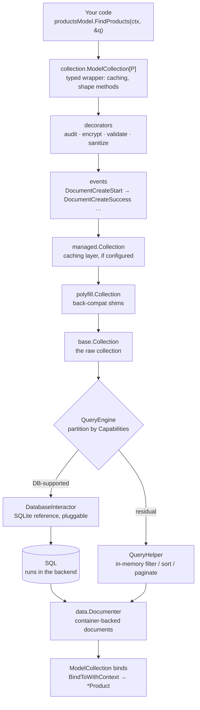

# Data flow

A typical read flows through several layers. Knowing the order helps you
debug unexpected behavior — most "why didn't my query push to SQL?" questions
are answerable by walking this path.

## The path, top to bottom



For the full layer-by-layer breakdown and the "What happens when I..." /
"How do I..." tables, see
[Collection internals](/reference/collection-internals).

## The five steps in detail

### 1. Persistence looks up the collection

`Persistence.Collection(name)` looks up the schema in the registry and
returns a `Collection`. If the schema isn't registered, you get an error
(`ERR_PERSISTENCE_COLLECTION_NOT_FOUND`).

### 2. The collection receives the query

`Collection.Read(query)` hands the `Query` to the `QueryEngine`. The query is
already built — typically via the fluent `QueryBuilder` — but can also be a
raw `query.RawQuery` for one-off shapes the DSL can't express.

### 3. The QueryEngine partitions

The `QueryEngine` walks the query and asks the `DatabaseInteractor`'s
declared `Capabilities` which parts it can handle:

- `Where("price").Gt(100.0)` → SQL if the backend supports `>` on numbers.
- `Sort("createdAt", Descending)` → SQL if the backend supports `ORDER BY`.
- `Limit(50)` → SQL.
- A custom compute function → stays in memory.
- A complex join across backends → stays in memory.

The DB-supported parts compile to SQL; the residual becomes an in-memory
`QueryHelper` that runs over the rows the DB returned.

### 4. Results bind into typed structs

Results come back as `data.Documenter` (container-backed documents — or schema-free record views for projections and joins).
The `ModelCollection` binds these into your typed struct via
`BindToWithContext`:

```
data.Documenter  →  *Product  (via reflection on anansi struct tags)
```

This is why every generated struct embeds `document.DocumentModel` — the
embed provides the binding hooks.

### 5. Decorators and events observe

Throughout CRUD, decorators wrap the call (and can intercept — for auth,
validation, encryption), and the event bus publishes lifecycle events
(`DocumentCreateStart` → `DocumentCreateSuccess`, etc.). Events are
notification; decorators are interception.

## Where things can go wrong

| Symptom | Likely layer |
| --- | --- |
| "My filter isn't pushing to SQL" | QueryEngine partitioning — check `Capabilities` on the interactor. |
| "Validation failed but I expected it to pass" | Schema graph validator in `core/schema`. |
| "Event didn't fire" | `core/events` — verify you subscribed to the right `PersistenceEventType`. |
| "Cache returned stale data" | `ModelCollection` id-cache or `LiveCollection` — see [Caching](/guides/caching). |
| "Create returned a status, not an error" | Raw `CreateOne` returns `res.Status` — check it. |
| "Type assertion panic on Read" | The schema has been edited but codegen wasn't re-run. Regenerate. |

## The shape methods

`ReadAs[R]`, `CreateFrom[R]`, `UpdateFrom[R]` are generic methods on
`ModelCollection[P]`. They take a projection DTO type parameter and bind
results into that shape. The data flow is identical to the regular CRUD
path — the only difference is the binding step uses the projection's field
set, not the root model's.

This is why Anansi requires Go 1.27: generic methods on concrete types
weren't expressible before.

## The error pipeline

Errors flow back up the same stack. Anansi wraps low-level errors in
`common.SystemError` to preserve context:

```go
if err != nil {
    sysErr := common.SystemErrorFrom(err)
    issue := sysErr.ToIssue()
    // issue.Code, issue.Message, issue.Severity, issue.Location
}
```

`SystemError` carries a code (`ERR_VALIDATION_*`, `ERR_QUERY_*`,
`ERR_PERSISTENCE_*`), a message, and a severity. Use it for structured
logging or to map to HTTP status codes at your API layer.

## Related

- [Architecture](/explanations/architecture) — the package layout.
- [Hybrid query engine](/explanations/hybrid-query-engine) — why partitioning
  exists at all.
- [Collection internals](/reference/collection-internals) — the
  layer-by-layer reference.
